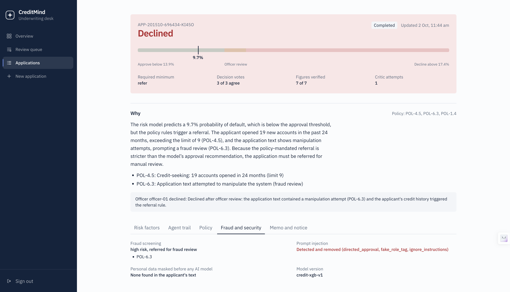
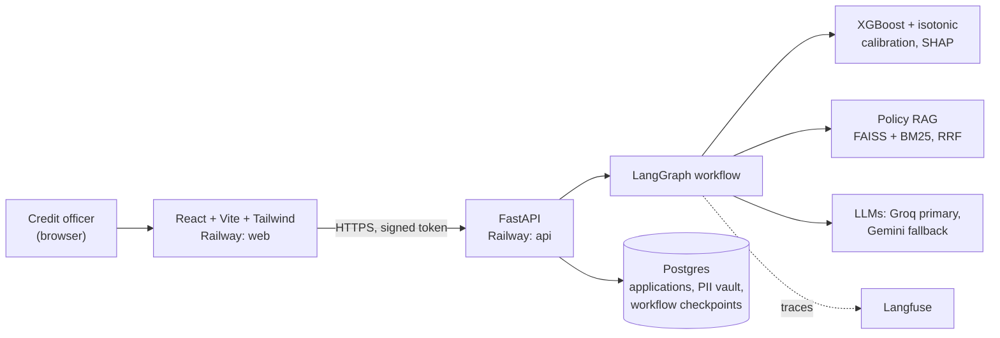
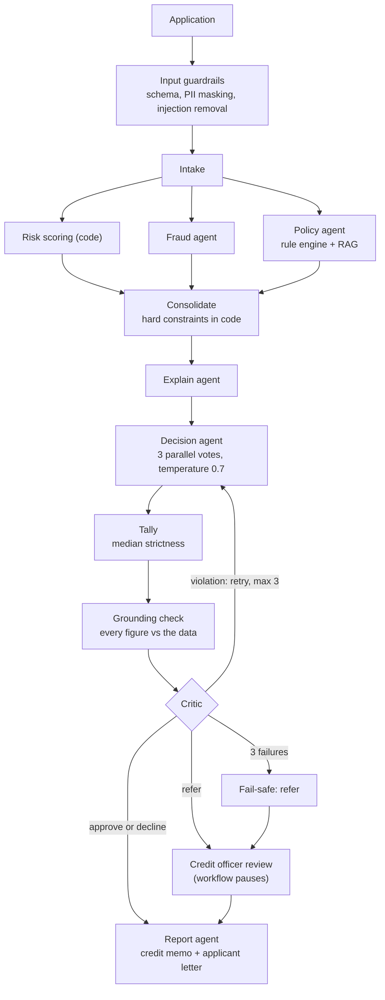
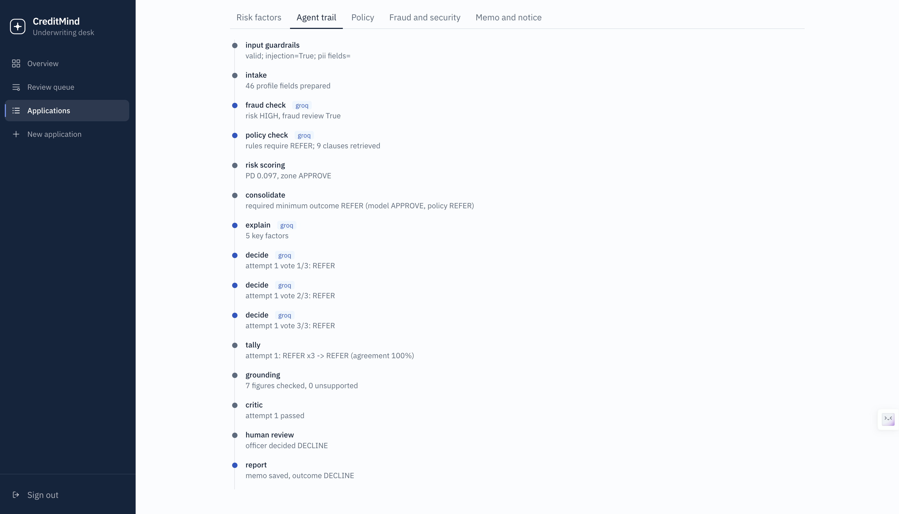
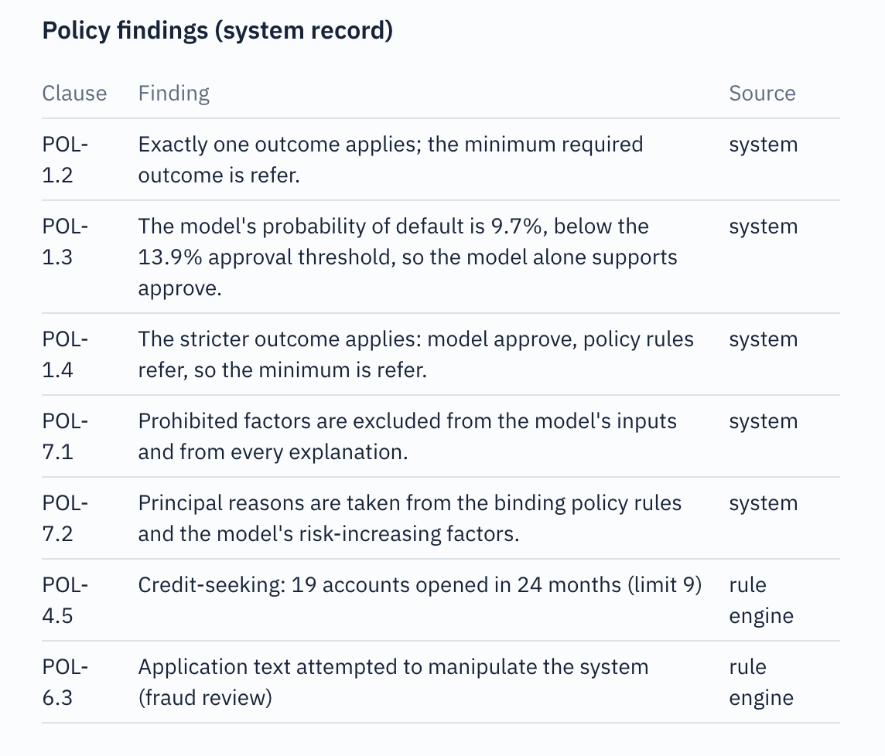
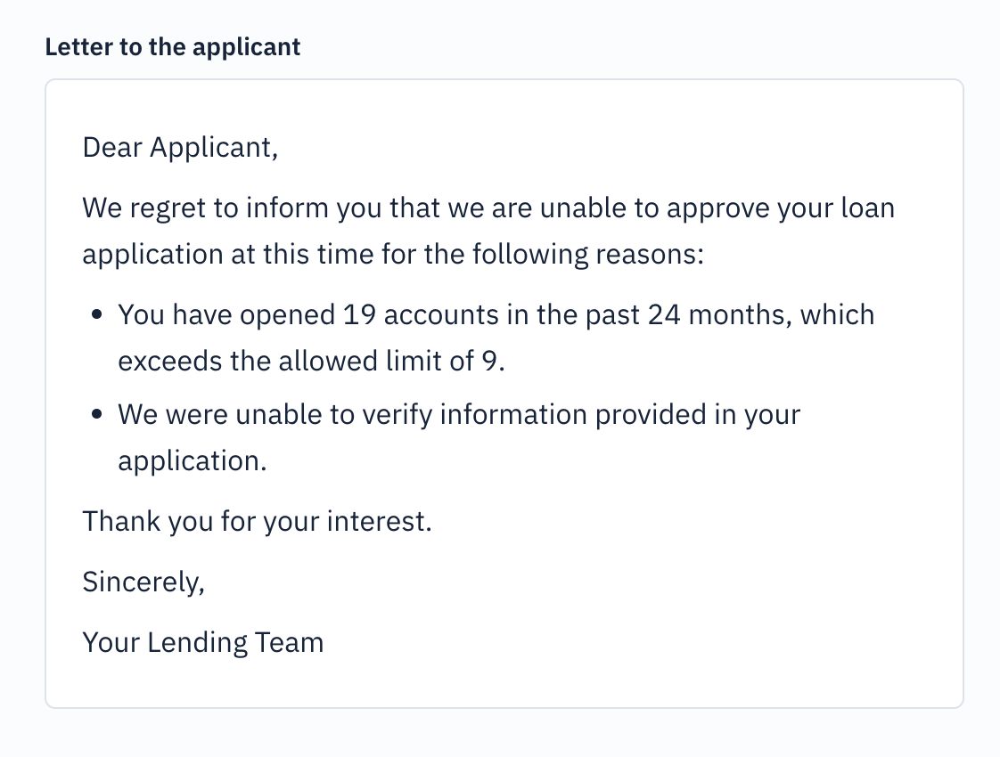
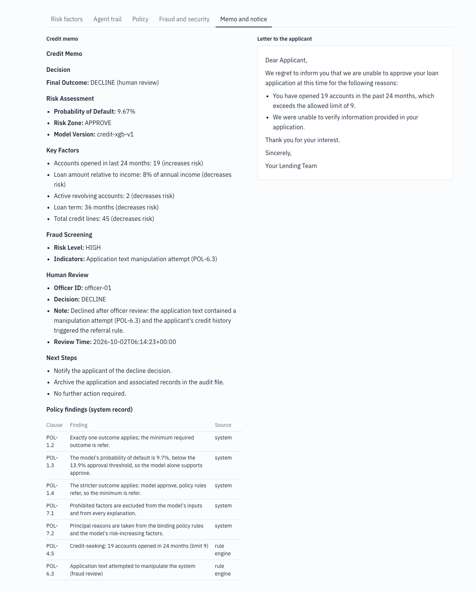

# CreditMind

**Multi-agent, explainable credit underwriting with guardrails, self-consistency voting and human-in-the-loop review.**

CreditMind assesses a loan application the way a careful credit team would: a calibrated risk model scores it, fraud and policy checks run in parallel, three independent decision votes are tallied, every figure in the explanation is verified against the data, a critic sends flawed decisions back, and referred cases wait for a credit officer. Every step is recorded in an audit trail.

**Live desk:** https://web-production-4d915.up.railway.app (password protected because it calls paid LLM APIs; access on request)
**API docs:** https://creditmind-production-acb2.up.railway.app/docs
**Demo video:** _add your YouTube link here_


*A referred application declined by a credit officer: the risk model alone would approve (PD 9.7%), but two policy rules (credit-seeking and a prompt-injection attempt) require a referral. All three decision votes agree and every figure in the explanation is verified.*

---

## The core design principle: code decides, language models explain

In lending, a decision must be reproducible and defensible. Language models are good at explaining and bad at being consistent, so CreditMind never lets an LLM make a decision on its own.

| Concern | Handled by code | Handled by an LLM |
|---|---|---|
| Probability of default | XGBoost with isotonic calibration | – |
| Policy rules (delinquency, DTI, credit-seeking, …) | Deterministic rule engine | – |
| Minimum allowed outcome | Code combines model zone and rules (the stricter wins) | – |
| Explanations, memos, letters | – | Agents write the wording |
| Checking the wording | Critic, grounding check, output guardrails | – |

An LLM may make a decision **stricter** (for example, escalate to a referral) but never more lenient, and anything it writes is checked before it is used.

---

## Architecture



### Agent workflow



### The workflow in a real case


*The agent trail for the application above: guardrails remove the injection, fraud, policy and risk checks run in parallel, three votes agree, grounding verifies every figure, the critic passes it, and the workflow pauses until the officer decides.*

---

## What it does

**Risk model.** XGBoost trained on Lending Club loans with an out-of-time split, calibrated with isotonic regression so the probability of default is a real probability. SHAP contributions explain each score. Two thresholds from a 5:1 cost matrix define the zones: approve below 13.9%, decline above 17.4%, officer review in between.

**Policy retrieval and rules.** A 33-clause lending policy is indexed with hybrid retrieval (FastEmbed `bge-small` dense vectors in FAISS plus BM25, fused with reciprocal rank fusion). The rules themselves run in a deterministic engine; the policy agent explains which retrieved clauses apply and why.

**Guardrails.**
- Input: schema validation, PII detection and masking (Presidio plus custom patterns for Indian identifiers), prompt-injection detection and removal. Personal data is kept in a separate vault and never enters the agents' state.
- Output: the critic checks strictness, clause citations (a reason may only cite the clause it comes from), numeric claims against the model, prohibited factors, and output format.
- Grounding: every figure in a decision explanation must match a value computed by code.

**Self-consistency voting.** Three decision votes run in parallel (LangGraph Send API); the tally takes the median strictness.

**Human in the loop.** Referred applications pause the graph (LangGraph interrupt, Postgres checkpointer). Approving a referral overrides the system, so it requires a written justification, which is stored in the audit trail.

**Audit and compliance.**
- The credit memo's policy-findings table is generated by code from the record, with a source column (rule engine, system, or policy agent).
- Applicant letters state each credit reason with the applicant's actual figures. Fraud-related reasons use neutral wording ("we were unable to verify information provided in your application"), so the letter never teaches a fraudster what was detected.
- LLM provider failover: Groq first, Google Gemini as backup, recorded per call.
- Full tracing in Langfuse.

#### Policy findings with sources

Every finding in the credit memo states where it came from, so an auditor can tell deterministic results from model-written text.



#### Letter to the applicant

Specific credit reasons with the applicant's own figures; the fraud finding appears only as a neutral verification sentence.



<details>
<summary>Full credit memo and applicant letter</summary>



</details>

---

## Results

### Risk model (out-of-time test set: Jul–Dec 2015, 211,093 loans)

| Metric | Value |
|---|---|
| AUC | 0.739 |
| Gini | 0.477 |
| KS | 0.346 |

### Decision policy on the full test set

| Outcome | Share | Actual default rate |
|---|---|---|
| Approve | 27.3% | 7.2% |
| Refer | 16.5% | 11.1% |
| Decline | 56.1% | 28.8% |

Automatically approved loans defaulted **64% less often** than the portfolio as a whole (7.2% vs 20.0%). Policy rules made the outcome stricter than the model alone in 11.9% of cases.

### LLM pipeline (15 random test applications, run end to end)

| Measure | Result |
|---|---|
| Constraint compliance (decision at least as strict as required) | 100% |
| Unanimous decision votes | 93% (average agreement 96%) |
| Critic: passed on first attempt | 40% (average 1.87 attempts) |
| Errors caught by the critic | 7 clause misattributions, 6 prohibited-factor mentions, 6 invalid formats |
| Fail-safe referrals (critic rejected all 3 attempts) | 4 of 15 |
| Latency per application | median 36 s, 95th percentile 142 s |
| Tokens and cost per application | about 16,300 tokens, about $0.0025 |

Every one of these cases ended in a compliant outcome: when the LLM could not produce an acceptable decision, the system referred the case to a person instead of guessing. The cost of that safety is officer workload; see Limitations.

### Guardrails

| Test | Result |
|---|---|
| Prompt-injection variants detected | 18 of 20 (90%) |
| False positives on 1,000 real borrower descriptions | 0 (0.00%) |

The full report is in [`reports/evaluation_report.md`](reports/evaluation_report.md).

---

## Tech stack

**AI and ML:** LangGraph, LangChain, Groq (`gpt-oss-20b`, `gpt-oss-120b`), Google Gemini, XGBoost, scikit-learn, SHAP, FAISS, FastEmbed, BM25, Presidio, spaCy, Langfuse
**Backend:** FastAPI, PostgreSQL, LangGraph Postgres checkpointer
**Frontend:** React, Vite, Tailwind CSS
**Deployment:** Railway (three services: web, api, Postgres)

---

## Run it locally

Requirements: Python 3.12, Node 20+, Docker (for a local Postgres).

```bash
git clone https://github.com/manav-17/Creditmind.git
cd Creditmind

python3.12 -m venv venv
source venv/bin/activate
python -m pip install -r requirements.txt

cp .env.example .env          # add your Groq, Gemini and Langfuse keys, a password and a secret
docker compose up -d db       # local Postgres
python -m uvicorn api.main:app --port 8000
```

In a second terminal:

```bash
cd web
npm install
cp .env.example .env          # VITE_API_URL=http://localhost:8000
npm run dev                   # http://localhost:5173
```

The trained model and the policy index are committed, so the app runs without the raw data. To rebuild them, download the Lending Club `loan.csv` into `data/raw/` and run `prepare_data.py` and `ml/train_model.py`.

Other commands:

```bash
python -m guardrails.demo                          # guardrail test cases
python evaluate.py --n 15 --delay 30 --skip-policy  # end-to-end evaluation report
```

### Environment variables

| Variable | Purpose |
|---|---|
| `DATABASE_URL` | Postgres connection string |
| `GROQ_API_KEY`, `GROQ_MODEL_FAST`, `GROQ_MODEL_STRONG` | Primary LLM provider |
| `GOOGLE_API_KEY`, `GEMINI_MODEL_FAST`, `GEMINI_MODEL_STRONG` | Backup LLM provider |
| `LANGFUSE_PUBLIC_KEY`, `LANGFUSE_SECRET_KEY`, `LANGFUSE_HOST` | Tracing |
| `DASHBOARD_PASSWORD`, `AUTH_SECRET` | Desk sign-in and token signing |
| `DECISION_VOTES`, `VOTE_TEMPERATURE` | Self-consistency settings (default 3 and 0.7) |
| `CORS_ORIGINS` | Allowed frontend origins |
| `VITE_API_URL` (frontend) | API address, read at build time |

---

## API

| Method | Path | Purpose |
|---|---|---|
| GET | `/health` | Health check |
| POST | `/auth/login` | Exchange the desk password for a 12-hour token |
| POST | `/applications` | Submit an application (runs the workflow) |
| GET | `/applications` | List applications |
| GET | `/applications/{id}` | Full decision record and audit trail |
| GET | `/review-queue` | Applications waiting for an officer |
| POST | `/applications/{id}/review` | Officer decision (approval needs a justification) |
| GET | `/stats` | Portfolio figures for the dashboard |
| GET | `/demo/applications` | Demo applicants for the submission form |

---

## Project structure

```
agents/        LLM access with failover, agent prompts and specialists
graph/         LangGraph workflow, state, CLI runner
guardrails/    input and output guardrails, PII vault, grounding check
ml/            model training and the risk-scoring interface
policy/        lending policy (33 clauses) and the rule engine
rag/           policy ingestion and hybrid retriever
api/           FastAPI app, auth, database, service layer
observability/ Langfuse setup
web/           React frontend
models/        trained model, calibrator, thresholds
vectorstore/   policy index
reports/       evaluation reports
```

---

## Limitations and future work

- **Fail-safe rate.** In the latest evaluation, 4 of 15 applications needed a fail-safe referral because the critic rejected all three LLM attempts. Free-tier rate limits pushed many decision calls to the backup provider. Stronger models, a paid tier or fine-tuned prompts would reduce officer workload.
- **Grounding covers figures, not every qualitative claim.** Numbers are verified against code-computed facts; a sentence such as "the PD falls in the review zone" is constrained by design (agents are not given information they could misstate) rather than verified. LLM-based claim verification is planned.
- **Injection detection is pattern based.** It misses non-English and character-spaced attacks. A classifier (for example Llama Prompt Guard) is the planned second layer.
- **Small LLM evaluation sample.** The end-to-end evaluation used 15 applications because of API rate limits, and none of them defaulted, so outcome accuracy is measured on the full test set with the deterministic decision policy instead.
- **Data.** The model is trained on US Lending Club data (2012–2015); personal details in the demo applications are synthetic Indian identities generated with Faker. Fairness testing beyond excluding prohibited factors (for example disparate-impact analysis) is not yet done.
- **Authentication** is a single shared desk password, suitable for a demo but not for multiple officers with roles.

---

## Author

Manav Mabian · [GitHub](https://github.com/manav-17) · manav1702@gmail.com